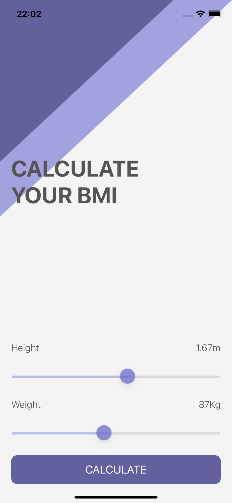

# Quizzler

## Descrição do projeto

Projeto de estudo do curso _iOS & Swift - The Complete iOS App Development Bootcamp_ com a finalidade de criar um aplicativo nativo iOS de calculadora de IMC.

## Conhecimentos adquiridos

- Classes e suas diferenças para struct
- Sliders
- Conceito de herança
- Aplicativos com mais de uma tela com segues
- Funcionalidades avançadas de Optionals

## Aplicação

